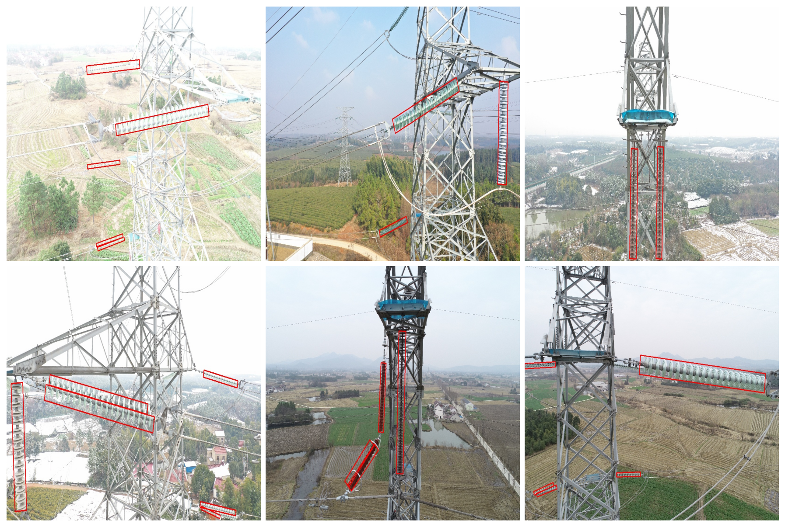

# Oriented Feature Alignment on Expanded Segments for Directional Insulator Detection

This repository contains the **official implementation** of our paper  
**"Oriented Feature Alignment on Expanded Segments for Directional Insulator Detection"**,  
which introduces line segment feature extraction into oriented object detection.  
The method is designed for **highly directional and elongated objects**,  
such as insulators in complex aerial power line scenes.

 

---

## 📰 News

- **[2026.4]** Public demo version is now available on GitHub 🎉  

---

## ✨ Highlights

In this work, we rethink oriented object detection by introducing **line-segment-based feature extraction** and achieving a balance between **accuracy** and **efficiency** across region- and point-based paradigms.

- 🧩 **Axis-Anchor Representation**  
  We model objects with strong orientation characteristics using **width-expandable axis segments**,  
  providing a compact yet expressive way to encode rotation and scale.

- ⚙️ **AxisAnchor Mechanism**  
  An orientation-aligned sampling mechanism designed for efficient feature extraction,  
  significantly improving both classification and bounding box regression.

- 🧠 **End-to-End Detection Framework**  
  The overall model integrates three modules:
  1. **AxisAnchor Proposal**  
  2. **AxisAnchor Filtering**  
  3. **Oriented Feature Alignment (OFA)**  
  Together, they form a stable and robust pipeline for insulator detection.

- 🚀 **Performance**  
  Our method achieves superior **accuracy**, **speed**, and **robustness**  
  on insulator datasets, especially for targets with **small aspect ratios** and **large scale variations**.

---

## 📦 Demo Dataset

⚠️ **Note:** The complete insulator dataset used in this paper is private due to data licensing.  
We provide several **sample images and annotations** for demonstration only.

